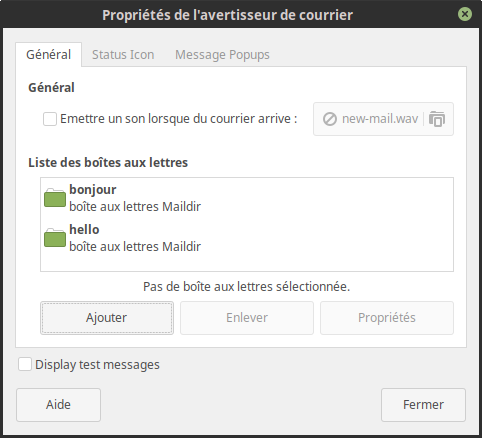

* table of contents
{:toc}

- <https://gitlab.com/muttmua/mutt/wikis/home>
- <https://gitlab.com/muttmua/mutt/wikis/MailConcept>
- <http://cedricduval.free.fr/mutt/fr/sitehtml/manual-3.html>
- <https://kofno.wordpress.com/2009/08/09/how-fetchmail-and-mutt-saved-me-from-email-mediocrity/>
- <https://lukeross.github.io/MuttrcBuilder/>
- <http://www.davep.org/mutt/muttrc/>
- <https://wiki.archlinux.org/index.php/Mutt#IMAP>

``` text
MUA -> MTA -------------> MRA ------> MDA --------------> MUA
mutt > sendmail/postfix > fetchmail > maildrop/procmail > mutt (qui lit le maildir)
```

## Configuration ##

### `~/.fetchmailrc` (Fetchmail) ###

Le fichier de conf de fetchmail, qui récupère les mails, et les stocke dans `/var/mail/patjennings`

``` conf
set daemon 60
set logfile fetchmail.log

poll ssl0.ovh.net protocol pop3:
     username "b*****@thom*****non.fr" password "xxXxXXx" is "bonjour" here keep mda "/usr/bin/maildrop";
     username "h****o@thom*****non.fr" password "xxXxXXx" is "hello" here mda "/usr/bin/maildrop";
```

> Sur "b*****@thom*****non.fr", l'option keep après `is {name} here` sert à laisser les mails sur le servueur une fois ramenés sur la machine.

### `~/.mailfilter` (Maildrop) ###

La conf de maildrop, qui prend les mails à partir du `/var/mail/patjennings`, et les répartit dans le `~/Maildir`

``` conf
DEFAULT="$HOME/Maildir/"
BONJOUR="$DEFAULT/bonjour/INBOX/"
HELLO="$DEFAULT/hello/INBOX/"

logfile "$HOME/maildrop.log"

if (/^(To|Cc|Bcc|Delivered-To):.*bonjour@thomasguesnon.fr/)
{
  to $BONJOUR
}

if (/^(To|Cc|Bcc|Delivered-To):.*hello@thomasguesnon.fr/)
{
  to $HELLO
}

to $DEFAULT
```

### `.mutt/muttrc` (Mutt) ###

La conf de mutt, qui se contente de lire le `~/Maildir`

### Envoi ###

``` bash
sudo apt-get install sendmail sendmail-bin msmtp
```

w/ msmtp

``` conf
# Valeurs par défaut pour tous les comptes.
defaults
auth           on
tls            on
tls_trust_file /etc/ssl/certs/ca-certificates.crt
tls_starttls   off # important, sinon le mail ne part pas via le port 465 (ssl/tls)
syslog	       on
logfile        ~/.msmtp.log

# Exemple pour un compte ovh
account        ovh
host           ssl0.ovh.net
port           465
from           bonjour@thomasguesnon.fr
user           bonjour@thomasguesnon.fr
password       xxXxXXx
timeout	       15

# Définir le compte par défaut
account default : ovh
```

checker avec `mailq`

## Notifications ##
Grâce à mail-notifier

``` bash
sudo apt-get install mail-notifier
```

Ensuite, on ajoute les dossiers qu'on veut observer
Ici, on sait que `fetchmail` récupère, transmet à `maildrop` qui ajoute aux dossiers qui vont bien dans le `~/Maildir`. Donc, on veut écouter `~/Maildir/{compte}/INBOX`. C'est celui-ci qu'on ajoute donc.




## Créer un nouveau dossier dans le maildir ##

``` bash
cd ~/Maildir/someAccount
mkdir -p INBOX.someBox/{cur,new,tmp}
```

## Flags ##


``` text
D : le message est supprimé (marqué pour la suppression)
d : le message a des pièces jointes marquées pour la suppression
K : contient une clé PGP publique
N : nouveau message
O : ancien message
P : le message est chiffré avec PGP
r : une réponse a été envoyée pour ce message
S : le message est signé par PGP et la signature a été verifiée
s : le message est signé par PGP
! : le message a l'indicateur 'important' de positionné
* : le message est marqué
----------
+ : vous êtes l'unique destinataire du message
T : vous êtes destinataire et d'autres personnes ont été placées en 'Cc'
C : une copie carbone du message vous a été adressée
F : vous êtes l'auteur du message
L : une de vos listes de diffusion est destinataire du message
```


## Principaux raccourcis ##

Mutt Command | Context | Effect | Tutorial Section | Relevant muttrc settings
:--- | :--- | :--- | :--- | :---
`a` | Sending Message | Attaches a file to the message you have created | [Sending Messages](https://www.ucolick.org/~lharden/learnmutt.html#Send) | none
`b` | Sending Message | Lets you edit the list of blind carbon copy recipients for the message you have created | [Sending Messages](https://www.ucolick.org/~lharden/learnmutt.html#Send) | none  
`c` | Sending Message | Lets you edit the list of carbon copy recipients for the message you have created | [Sending Messages](https://www.ucolick.org/~lharden/learnmutt.html#Send) | none  
`d` | Main Menu, Reading Message | Marks the current message for deletion | [Deleting Messages](https://www.ucolick.org/~lharden/learnmutt.html#Delete) | none  
`f` | Main Menu, Reading Message | Forwards the message to another address | [Forwarding Messages](https://www.ucolick.org/~lharden/learnmutt.html#Forward) | askbcc, askcc, edit_headers, editor  
`i` | Reading Message | Returns from reading a message to the Main Menu | [Reading Messages](https://www.ucolick.org/~lharden/learnmutt.html#Read) | none  
`j` | Main Menu | Changes the selected message to the next message | [Getting Around in the Menu](https://www.ucolick.org/~lharden/learnmutt.html#Menu) | color  
`k` | Main Menu | Changes the selected message to the previous message | [Getting Around in the Menu](https://www.ucolick.org/~lharden/learnmutt.html#Menu) | color  
`m` | Main Menu, Reading Message | Creates a new message to send | [Sending Messages](https://www.ucolick.org/~lharden/learnmutt.html#Send) | abort_nosubject, abort_unmodified, askbcc, askcc, edit_headers, editor, recall  
`mutt` | Command line | Starts mutt | [Getting Into and Out of the Mutt Menu](https://www.ucolick.org/~lharden/learnmutt.html#Start) | beep-new, color, mark_old, move, sort  
`p` | Main Menu, Reading Message | Prints the currently selected message | [Printing Messages](https://www.ucolick.org/~lharden/learnmutt.html#Print) | print, print_command  
`q` | Main Menu | Quits mutt | [Getting Into and Out of the Mutt Menu](https://www.ucolick.org/~lharden/learnmutt.html#Start) | delete, mark_old, mbox, move  
`q` | Sending Message | Aborts or postpones the message you have created | [Sending Messages](https://www.ucolick.org/~lharden/learnmutt.html#Send) or [Postponing Messages](https://www.ucolick.org/~lharden/learnmutt.html#Postpone) | postpone, postponed  
`r` | Main Menu, Reading Message | Creates a reply to the current message | [Replying to Messages](https://www.ucolick.org/~lharden/learnmutt.html#Reply) | abort_nosubject, abort_unmodified, askbcc, askcc, edit_headers, editor, include, metoo  
`s` | Main Menu, Reading Message | Saves the current message to a file | [Saving Messages](https://www.ucolick.org/~lharden/learnmutt.html#Save) | folder  
`s` | Sending Message | Lets you change the subject for the message you have created | [Sending Messages](https://www.ucolick.org/~lharden/learnmutt.html#Send) | none  
`t` | Sending Message | Lets you edit the list of recipients for the message you have created | [Sending Messages](https://www.ucolick.org/~lharden/learnmutt.html#Send) | none  
`u` | Main Menu, Reading Message (messages marked for deletion only) | Removes the deletion mark from the current message | [Deleting Messages](https://www.ucolick.org/~lharden/learnmutt.html#Delete) | none  
`x` | Help Menu | Returns from the help menu to the Main Menu | [Getting Around in the Menu](https://www.ucolick.org/~lharden/learnmutt.html#Menu) | none  
`y` | Sending Message | Sends the message you have created | [Sending Messages](https://www.ucolick.org/~lharden/learnmutt.html#Send) | abort_unmodified, copy, record  
`?` | Main Menu | Goes from the Main Menu to the Help Menu | [Getting Around in the Menu](https://www.ucolick.org/~lharden/learnmutt.html#Menu) | color  
`-` | Reading Message | Moves to the previous page in the message you are reading | [Reading Messages](https://www.ucolick.org/~lharden/learnmutt.html#Read) | none  
`/` | Main Menu | Prompts for a pattern to search for in the headers of your messages | [Getting Around in the Menu](https://www.ucolick.org/~lharden/learnmutt.html#Menu) | none  
`=` | Main Menu | Selects the first message | [Getting Around in the Menu](https://www.ucolick.org/~lharden/learnmutt.html#Menu) | color, sort  
`$` | Main Menu | Deletes all messages selected for deletion, and checks for new messages | [Deleting Messages](https://www.ucolick.org/~lharden/learnmutt.html#Delete) | beep_new, delete, mark_old, mbox, move  
`*` | Main Menu | Selects the last message | [Getting Around in the Menu](https://www.ucolick.org/~lharden/learnmutt.html#Menu) | color, sort  
`< number >` | Main Menu | Selects message < number > | [Getting Around in the Menu](https://www.ucolick.org/~lharden/learnmutt.html#Menu) | color  
`< Enter >` | Main Menu | Brings the currently selected message up on the screen | [Reading Messages](https://www.ucolick.org/~lharden/learnmutt.html#Read) | color  
`< Space >` | Reading Message | Moves to the next page in the message you are reading, or to the first page of the next message not marked for deletion | [Reading Messages](https://www.ucolick.org/~lharden/learnmutt.html#Read) | none  
`< Tab >` | Main Menu | Selects the next new message | [Getting Around in the Menu](https://www.ucolick.org/~lharden/learnmutt.html#Menu) | color  
`< Esc > /` | Main Menu | Prompts for a pattern to search for in the bodies of your messages | [Getting Around in the Menu](https://www.ucolick.org/~lharden/learnmutt.html#Menu) | none  
`up/down arrow` | Main Menu | Changes the selected message to the previous/next message | [Getting Around in the Menu](https://www.ucolick.org/~lharden/learnmutt.html#Menu) | color  
`PageUp/PageDown` | Main Menu, Reading Message | Moves up/down one page in the Main Menu or the message you are reading | [Getting Around in the Menu](https://www.ucolick.org/~lharden/learnmutt.html#Menu) or [Reading Messages](https://www.ucolick.org/~lharden/learnmutt.html#Read) | none  


## Gestion des spams ##

à gérer au niveau du MDA (pour moi, maildrop). Voir `~/.mailfiter`
- <https://wiki.uberspace.de/mail:maildrop>
- <https://blog.macfrog.de/maildrop-revisited/>

ajouter au `~/.mailfilter`

``` conf
SPAMS="$DEFAULT/spam/" # dossier des spams ($DEFAULT est $HOME/Maildir/)

# process SPAM
if ((/^X-Spam-Flag: YES/:h) || (/^X-Spam-Status: Yes/:h) || (/^X-Spam-Tag: Yes/:h) )
{
to $SPAMS
}
```

## Divers, utilisation ##

#### Détacher un attachement ####
Dans l'affichage de la structure du message, taper `D` sur l'attachement qu'on veut détacher.

#### Déplacer plusieurs messages vers un dossier ####
- tag messages : `t` pour tagger un message, `ESC t` pour tagger tout un thread
- tell mutt to apply a function to tagged messages. press `;` 

``` text
; tag-prefix apply next function to tagged messages
```
- Save them. press `s`. Messages are copied to folder, and original ones in main box are marked for deletion.


## Rechercher w/ notmuch ##

``` bash
sudo apt-get install notmuch-mutt # installe auto notmuch
```

Dans le `muttrc`

``` text
macro index <F8> \
"<enter-command>set my_old_pipe_decode=\$pipe_decode my_old_wait_key=\$wait_key nopipe_decode nowait_key<enter>\
<shell-escape>notmuch-mutt -r --prompt search<enter>\
<change-folder-readonly>`echo ${XDG_CACHE_HOME:-$HOME/.cache}/notmuch/mutt/results`<enter>\
<enter-command>set pipe_decode=\$my_old_pipe_decode wait_key=\$my_old_wait_key<enter>" \
"notmuch: search mail"
```

donc, en tapant `f8` dans mutt, on accède à `notmuch`. quelques exemples de recherche

``` bash
from:will@example.com AND to:john@example.com OR to:jane@example.com
```

``` bash
date:”2015-09-01″..”2015-09-02″
```

``` bash
budget AND FY14 OR FY15 AND date:”2015-09-01″..”2015-09-02″
```

sur cette ligne de commande, on peut rechercher d'autres critères de recherche avec `?` (ou `man notmuch-search-terms` hors de `mutt`) 

> Voir <https://notmuchmail.org/notmuch-mutt/>
