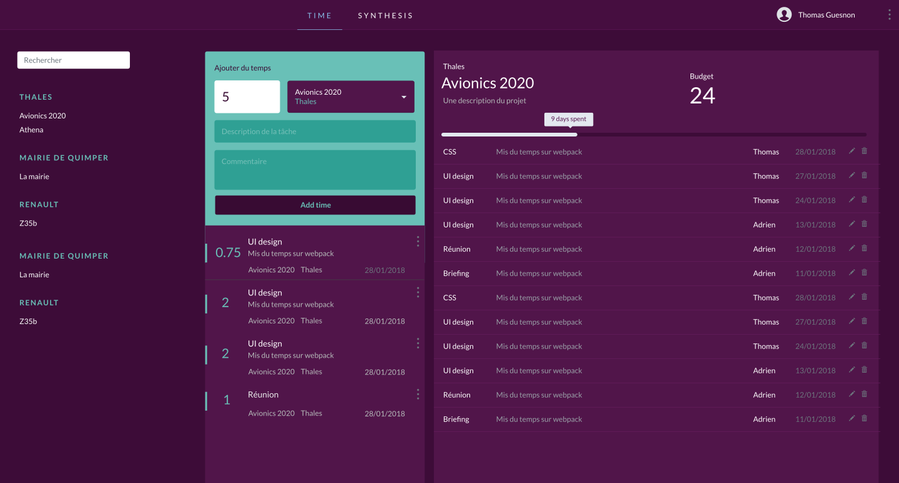

*PisteurDeTemps* est une application de gestion du temps passé, que l'on peut utiliser seul ou en équipe. C'est une application construite avec Node, React (w/ Mobx pour le store) et qui utilise une base MongoDB. L'idée est de pouvoir l'installer facilement sur un serveur, pour pouvoir l'utiliser à la maison et gérer ses données soi-même.

Le principe est relativement simple, et l'écran principal se présente de la façon suivante : 
- une zone où l'on rentre son temps, et où l'on voit l'historique de ses entrées
- une zone où l'on peut visualiser les temps passés sur un projet, et voir, au global, le temps consommé, les personnes actives

Il est prévu de construire un écran de synthèse, où les données de chaque projet seront affichées de façon à percevoir les tâches accomplies, les utilisateurs les plus actifs, etc. Des capacités d'exports dans différents formats (csv, json) sont également prévues.

- [Code source](https://framagit.org/patjennings/time-tracker)
